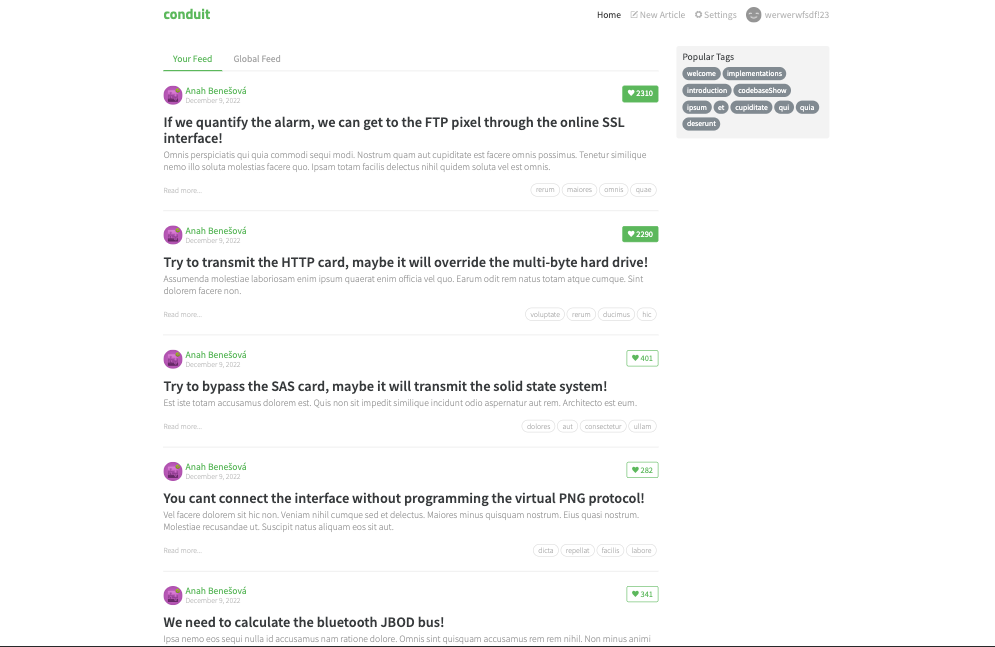
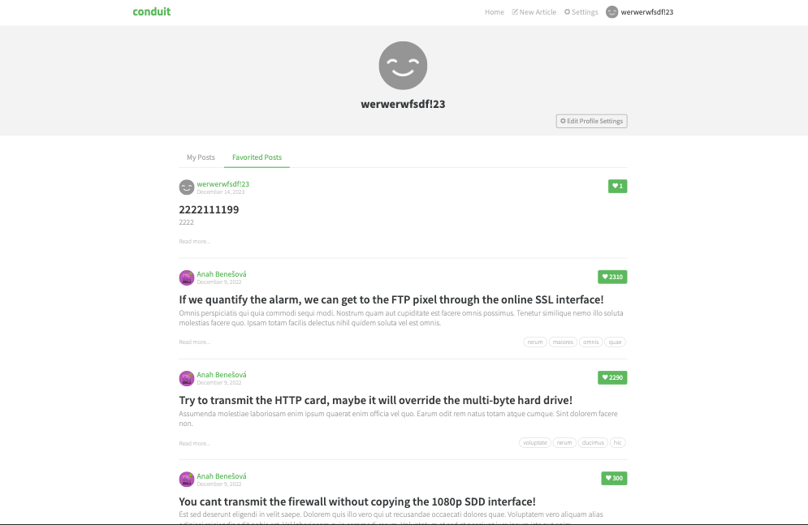
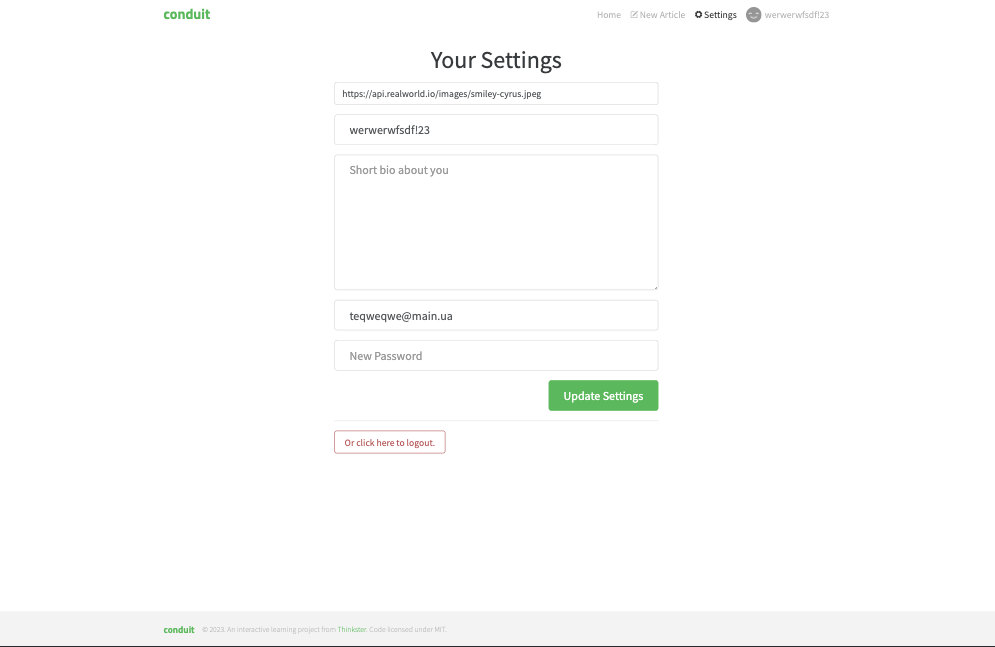
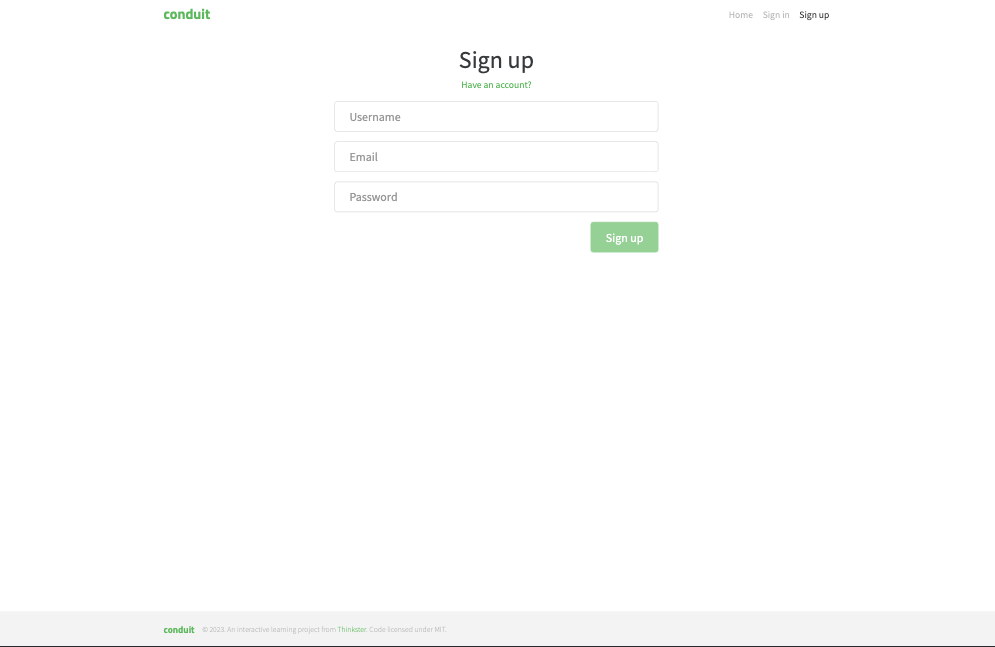

# Medium (Twitter) clone Angular 16

A brief description of your application built on the RealWorld API.

## Description

This is an Angular application developed following the [RealWorld API](https://github.com/gothinkster/realworld). RealWorld provides a unified API and specification for building social platforms using various technologies.

## Features

1. **Authentication and Authorization:**
  - User authentication mechanisms.
  - Authorization features for secure access.

2. **CRUD Operations:**
  - Create, Read, Update, and Delete operations for data management.

3. **RealWorld-Styled Interface:**
  - User interface designed in accordance with RealWorld standards and best practices.

4. **User Interactions:**
  - Subscribe to other users.
  - Like and dislike other users.
  - Like and unlike posts.

5. **Routing:**
  - Implement routing for seamless navigation.

6. **Post Management:**
  - Add and remove posts.
  - Edit existing posts.

7. **Profile Customization:**
  - Configure and customize user profiles.

8. **Subscription System:**
  - Enable the functionality to subscribe to users.

9. **Like System:**
  - Allow users to like posts.

10. **Advanced Post Features:**
  - Implement additional post-related features.

Each feature contributes to a richer and more interactive user experience in the application.

## Technologies

- **Angular**: Version of your Angular framework.
- **RxJS**: Use of reactive streams for managing data and events.
- **NgRx Store**: State management library for Angular applications.
- **NgRx Effects**: Middleware for handling side effects in your application.
- **NgRx Selectors**: Efficiently querying and selecting slices of state.
- **NgRx Reducers**: Functions that specify how the application's state changes in response to actions.
- **Bootstrap (or other styling framework)**: For creating a stylish user interface.

## Installation

1. Clone the repository:
   git clone https://github.com/kulakovskyi/twitter-angular-realworld.git

2. Install dependencies:
   npm install

3. Run the application:
   ng serve

## Demo

Explore the live version of the application [HERE](https://twitter-clone-angular.web.app/).

## Screenshots

Insert screenshots showcasing various aspects of your application here.

## Contribution

Your contributions are welcome! If you have suggestions to enhance the project or if you've encountered a bug, feel free to create an issue or submit a pull request.
